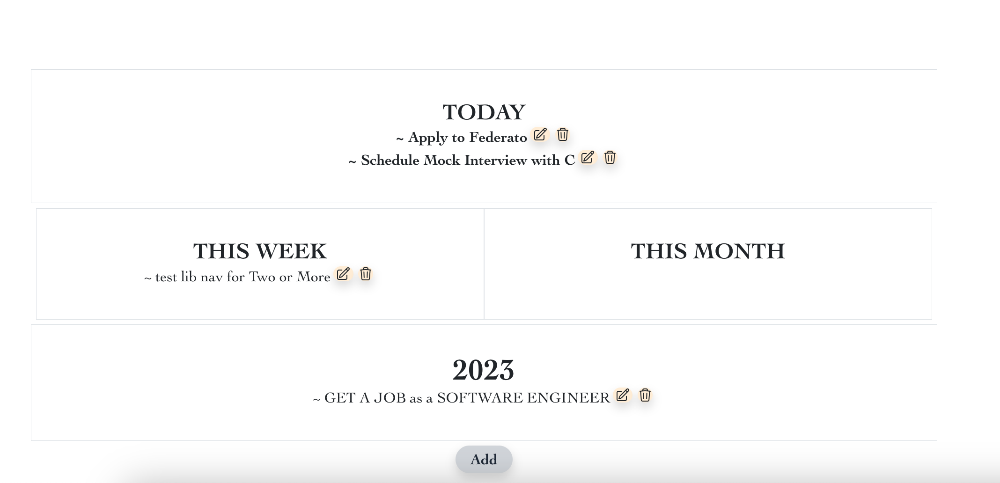

# JobSurge Server ⚡
[Front-End Repo](https://github.com/gnieb/jobwave)

## About
**SURGE [ v ]:** 
**to move suddenly and powerfully forward or upward.** 

This application is a career dashboard. It was originally developed to help me get a job at a company I REALLY wanted to work for, but at that time, they didn't have the jobs posted that fit my qualifications. 
=> **Enter JobSurge.**
I needed to develop a career dashboard to help me navigate my job search, organize my priorities, and categorize my goals by Day, Week, Month, and Year. JobSurge was built to navigate my transition from Human Resources into tech. 

### Built with
* 
* 
* 
*  
*  
* 
* 
* 

## Features Completed
- SQLite3 lightweight database established with models
- Web Driver installed and utilized to scrape dynamic data from selected company careers
**Note:** Selenium uses the binary driver to control the web browser of choice. This Python package provides binary drivers for the following supported web browsers: Chrome, Chromium, Brave, Firefox, IE, Edge, and Opera. Note that Safari is not supported.
- Full CRUD actions for To do's model
- RESTful API built

## Features in progress
- Web Scraper to pull startup 'Software Engineer' job positions from Wellfound (previously AngelList)

